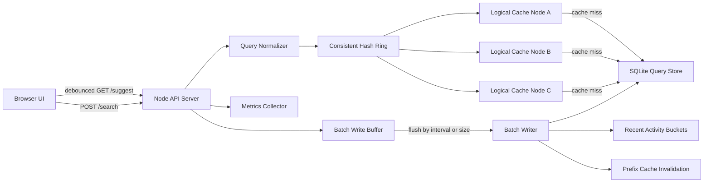

# Project Report: Search Typeahead System

## 1. Architecture Diagram / Architecture Explanation



The system is a full-stack typeahead application served by one Node.js process. The browser UI sends debounced requests to the backend while the user types. The backend normalizes the prefix, checks the distributed logical cache using consistent hashing, and falls back to SQLite only on a cache miss.

Search submissions are not written synchronously for every request. `POST /search` appends the query to an in-memory aggregation buffer. The batch writer periodically flushes repeated queries as aggregated SQLite upserts, updates recent activity for trending searches, and invalidates affected prefix cache keys.

Main components:

- Browser UI: search box, suggestions dropdown, keyboard navigation, trending panel, cache debug panel.
- API server: Node `http` server exposing suggestion, search, cache debug, trending, metrics, and flush endpoints.
- Query store: SQLite table with query text, normalized query text, count, and timestamps.
- Cache cluster: three logical cache nodes.
- Consistent hash ring: maps prefix cache keys to cache nodes using virtual nodes.
- Trending service: tracks recent query activity in rolling time buckets.
- Batch writer: aggregates query-count updates before writing to SQLite.
- Metrics collector: records latency, cache hit rate, DB reads/writes, and write reduction.

## 2. Dataset Source and Loading Instructions

The project uses a deterministic generated dataset to satisfy the assignment's requirement of at least `100,000` queries with counts.

Dataset files:

- Generator script: `scripts/generate-dataset.js`
- Generated CSV: `data/generated_queries.csv`
- Loaded database: `data/typeahead.db`

Dataset size:

- `120,000` generated rows during normal seeding.

CSV format:

```csv
query,count
iphone tutorial india,379473
iphone tutorial usa,369112
java tutorial database,18922
```

The generator creates search-like phrases across categories such as phones, programming, cloud, finance, sports, travel, recipes, and product searches. Counts are generated with a skewed popularity distribution so ranking behavior is visible in the UI.

Load locally:

```bash
npm run seed
```

Run locally after loading:

```powershell
$env:PORT="3002"
npm start
```

Run with Docker:

```bash
docker compose up --build
```

Then open:

```text
http://localhost:3002
```

Important: do not run `npm run seed` while the server is running, because the seed script recreates the SQLite database file.

## 3. API Documentation

Base URL for local testing:

```text
http://localhost:3002
```

| Endpoint | Method | Purpose |
|---|---|---|
| `/suggest?q={prefix}` | GET | Required endpoint. Returns up to 10 prefix matches sorted by all-time count. |
| `/suggest?q={prefix}&rank=trending` | GET | Enhanced endpoint. Returns up to 10 prefix matches using recency-aware ranking. |
| `/search` | POST | Required endpoint. Returns `"Searched"` and queues a batched count update. |
| `/cache/debug?prefix={prefix}` | GET | Required endpoint. Shows consistent-hash cache owner and hit/miss. |
| `/trending` | GET | Returns top trending searches for the UI. |
| `/metrics` | GET | Returns latency, cache, DB read/write, and batching metrics. |
| `/admin/flush` | POST | Forces pending batched writes to flush. Useful for testing/demo. |

### `GET /suggest?q=<prefix>`

Example:

```bash
curl "http://localhost:3002/suggest?q=java"
```

Behavior:

- Returns at most 10 suggestions.
- Suggestions must start with the typed prefix.
- Results are sorted by `count` descending by default.
- Empty or missing input returns an empty suggestion list.
- Mixed-case input is normalized.
- Prefixes with no matches return an empty list.

Example response:

```json
{
  "prefix": "java",
  "rankingMode": "count",
  "suggestions": [
    {
      "query": "java tutorial database",
      "count": 18922,
      "recentCount": 0,
      "score": 18922
    }
  ],
  "source": "cache"
}
```

### `GET /suggest?q=<prefix>&rank=trending`

Example:

```bash
curl "http://localhost:3002/suggest?q=java&rank=trending"
```

This uses the same suggestion API with recency-aware scoring. It combines historical popularity and recent activity so recently searched queries can temporarily rank higher.

### `POST /search`

Example:

```bash
curl -X POST "http://localhost:3002/search" \
  -H "Content-Type: application/json" \
  -d "{\"query\":\"java spring boot\"}"
```

Example response:

```json
{
  "message": "Searched",
  "query": "java spring boot",
  "writeMode": "batched"
}
```

The query-count update is queued and eventually flushed by the batch writer.

### `GET /cache/debug?prefix=<prefix>`

Example:

```bash
curl "http://localhost:3002/cache/debug?prefix=java"
```

Example response:

```json
{
  "prefix": "java",
  "rankingMode": "count",
  "cacheKey": "suggest:count:java",
  "ownerNode": "cache-node-a",
  "hit": true,
  "nodes": [
    { "id": "cache-node-a", "entries": 3 },
    { "id": "cache-node-b", "entries": 2 },
    { "id": "cache-node-c", "entries": 4 }
  ]
}
```

This endpoint demonstrates consistent-hash cache routing.

## 4. Design Choices and Trade-Offs

### Prefix Search With SQLite

Choice: store query-count data in SQLite and use normalized prefix lookup.

Reason:

- Easy to run locally.
- Reliable enough for the assignment demo.
- Works well with the required `100,000+` query dataset when combined with caching.

Trade-off:

- A trie or finite-state transducer would be faster at very large scale, but it is more complex to persist, update, and explain.

### Cache-Aside Strategy

Choice: cache suggestion results by prefix.

Flow:

1. Check cache for `suggest:<rank-mode>:<prefix>`.
2. Return cached result on hit.
3. Query SQLite on miss.
4. Store result in cache with TTL.

Trade-off:

- Cache hits are fast and reduce DB reads.
- Cache entries can become stale, so the system uses TTL plus targeted prefix invalidation after batch flush.

### Distributed Logical Cache With Consistent Hashing

Choice: use three logical cache nodes and a consistent hash ring with virtual nodes.

Reason:

- Satisfies the assignment requirement for distributed cache behavior.
- Demonstrates how prefixes are routed to cache owners.
- Adding/removing cache nodes would move only part of the keyspace.

Trade-off:

- This local demo does not run separate Redis containers.
- Production would use Redis/Memcached nodes while keeping the same consistent-hashing design.

### Batch Writes

Choice: aggregate repeated searches in an in-memory `Map<query, delta>`.

Reason:

- Avoids a database write for every search request.
- Greatly reduces write pressure when users repeatedly search similar queries.

Trade-off:

- Counts are eventually consistent.
- If the process crashes before flush, buffered updates can be lost.
- Production would use a durable queue or write-ahead log before acknowledging writes.

### Trending Searches

Choice: combine historical count with recent activity.

Scoring idea:

```text
score = log10(all_time_count + 1) * 100 + recent_count * 25
```

Reason:

- Historical count keeps stable popular queries visible.
- Recent activity lets fresh searches rise.
- Rolling buckets decay old recent activity so temporary spikes do not stay over-ranked forever.

Trade-off:

- More freshness means more cache invalidation and ranking work.
- The implementation keeps complexity manageable with rolling buckets and TTL.

## 5. Performance Report

Run benchmark:

```bash
npm run benchmark
```

The benchmark starts an isolated server on port `3100`, sends suggestion/search traffic, flushes batched writes, and writes the generated report to:

```text
docs/generated-performance-report.md
```

Latest generated benchmark:

| Area | Result |
|---|---:|
| Rows loaded | 120,005 |
| Cold-ish requests | 100 |
| Cold-ish p50 latency | 0.52 ms |
| Cold-ish p95 latency | 23.79 ms |
| Warm-cache requests | 300 |
| Warm-cache p50 latency | 0.44 ms |
| Warm-cache p95 latency | 0.76 ms |
| Cache hit rate | 97.50% |
| Cache hits | 390 |
| Cache misses | 10 |
| Example cache owner for `java` | cache-node-a |
| Search requests in batch test | 200 |
| DB writes after aggregation | 2 |
| Write reduction | 99.00% |
| Batch flushes | 1 |

Write reduction formula:

```text
write_reduction = 1 - (actual_db_writes / search_requests)
```

For this benchmark:

```text
1 - (2 / 200) = 99%
```

Conclusion:

- Warm-cache latency is low because repeated prefixes are served from cache.
- Cache hit rate is high for repeated-prefix workloads.
- Batch writes significantly reduce database writes by aggregating duplicate search submissions.
