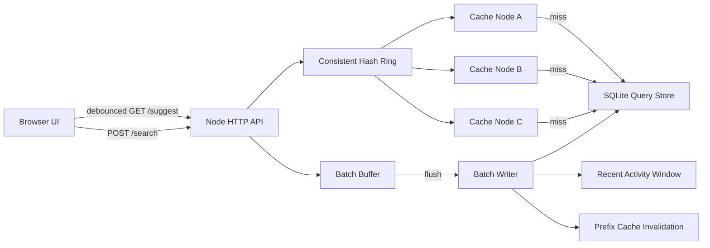

# Search Typeahead System

HLD assignment implementation for a search typeahead system with:

- 100,000+ query dataset ingestion.
- `GET /suggest?q=<prefix>` suggestions.
- `POST /search` dummy search submission.
- `GET /cache/debug?prefix=<prefix>` consistent-hash cache routing debug.
- Debounced browser UI.
- Suggestions sorted by count or recency-aware trending score.
- Query-count updates through batch writes.
- Distributed logical cache nodes using consistent hashing.
- Metrics for latency, cache hit rate, DB reads/writes, and batching write reduction.

## Requirements

- Node.js 24 or newer.
- No external npm packages are required. The app uses Node's built-in HTTP server and `node:sqlite`.

## Run Locally

```bash
npm run seed
npm start
```

Open:

```text
http://localhost:3000
```

## Dataset

The included generator creates `120,000` query rows at:

```text
data/generated_queries.csv
```

Then `scripts/load-dataset.js` loads the rows into:

```text
data/typeahead.db
```

The CSV format is:

```csv
query,count
iphone tutorial india,379473
iphone tutorial usa,369112
```

This satisfies the assignment requirement of at least `100,000` queries.

## API Summary

See [API documentation](docs/API.md).

Minimum required APIs:

```http
GET /suggest?q=<prefix>
POST /search
GET /cache/debug?prefix=<prefix>
```

Additional demo APIs:

```http
GET /trending
GET /metrics
POST /admin/flush
```

## Architecture

See [architecture notes](docs/ARCHITECTURE.md).



## Performance Report

Generate a report:

```bash
npm run perf
```

The report is written to:

```text
docs/generated-performance-report.md
```

It includes:

- p50/p95 suggestion latency.
- Cache hit rate.
- Consistent hash owner example.
- Search requests vs actual DB writes.
- Batch write-reduction percentage.

## Design Trade-Offs

See [design trade-offs](docs/DESIGN_TRADEOFFS.md).

Short version:

- SQLite prefix search is simpler than a trie and enough for a 100K-row assignment demo.
- Logical cache nodes demonstrate distributed cache ownership locally without needing Redis.
- Consistent hashing avoids remapping every key if cache nodes change.
- Batch writes reduce database pressure but make query counts eventually consistent.
- Trending score uses recent activity with decay so short-lived spikes do not stay highly ranked forever.

## What To Submit

Submit the repository with:

- Source code.
- This `README.md`.
- Dataset generation/loading instructions.
- [API documentation](docs/API.md).
- [Architecture diagram and explanation](docs/ARCHITECTURE.md).
- [Performance report](docs/PERFORMANCE.md) or generated report.
- [Design trade-offs](docs/DESIGN_TRADEOFFS.md).
- Screenshots or a short demo video of the UI and endpoints.

## Viva Prep

See [viva question bank](docs/VIVA_QUESTIONS.md).
