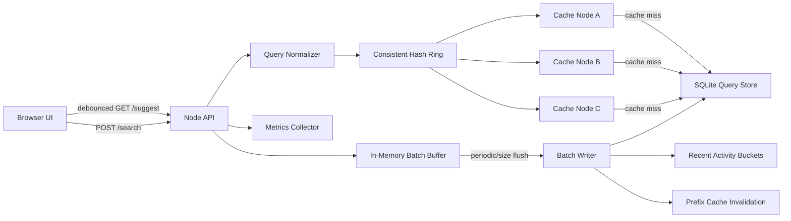

# Search Typeahead System

A working search typeahead assignment project with a browser UI, low-latency suggestion API, distributed logical cache using consistent hashing, trending search ranking, and batched query-count updates.

Repository: `typeahead-system`

## Features

- 120,000 generated query rows with `query,count` format.
- Prefix suggestions with max 10 results.
- `GET /suggest?q=<prefix>` defaults to count-sorted results.
- `GET /suggest?q=<prefix>&rank=trending` uses recency-aware ranking.
- `POST /search` returns `{ "message": "Searched" }` and queues count updates.
- Batch writer aggregates repeated searches before writing to SQLite.
- Cache-aside suggestion flow before primary-store fallback.
- Three logical cache nodes with consistent hashing and virtual nodes.
- `GET /cache/debug?prefix=<prefix>` shows owner node and hit/miss.
- Debounced frontend search box with dropdown, keyboard navigation, loading/error states, and trending panel.
- Metrics and benchmark report for p50/p95 latency, cache hit rate, and write reduction.

## Tech Stack

- Node.js 24
- Built-in `node:http`
- Built-in `node:sqlite`
- HTML/CSS/JavaScript frontend served by the same Node process
- Docker / Docker Compose support

No external npm packages are required.

## Quick Start With Docker

Docker builds the app, generates the dataset, loads SQLite, and starts the server.

```bash
docker compose up --build
```

Open:

```text
http://localhost:3002
```

The compose file maps host port `3002` to container port `3000` because port `3000` is often already used locally.

## Local Setup

```bash
npm run seed
npm test
$env:PORT="3002"
npm start
```

Open:

```text
http://localhost:3002
```

If you use bash/macOS/Linux:

```bash
PORT=3002 npm start
```

Do not run `npm run seed` while the server is running, because the seed script recreates the SQLite database file.

## Dataset Source and Loading

This project uses a deterministic generated query dataset to satisfy the assignment's minimum size requirement.

- Generated file: `data/generated_queries.csv`
- Loaded database: `data/typeahead.db`
- Row count: `120,000`
- Format:

```csv
query,count
iphone tutorial india,379473
iphone tutorial usa,369112
```

Generate and load:

```bash
npm run seed
```

The generator creates query-like phrases across domains such as phones, programming, cloud, finance, sports, travel, recipes, and product searches. Counts are generated with a skewed popularity distribution so typeahead ranking is visible in the UI.

## API Documentation

| Endpoint | Method | Purpose |
|---|---|---|
| `/suggest?q={prefix}` | GET | Required endpoint. Returns up to 10 prefix matches sorted by all-time count. |
| `/suggest?q={prefix}&rank=trending` | GET | Enhanced endpoint. Returns up to 10 prefix matches using recency-aware ranking. |
| `/search` | POST | Required endpoint. Returns `"Searched"` and queues a batched count update. |
| `/cache/debug?prefix={prefix}` | GET | Required endpoint. Shows consistent-hash owner node and cache hit/miss. |
| `/trending` | GET | Returns top trending searches for the UI. |
| `/metrics` | GET | Returns latency, cache, DB read/write, and batching metrics. |
| `/admin/flush` | POST | Forces the batch writer to flush, useful for demos. |

Example:

```bash
curl "http://localhost:3002/suggest?q=java"
curl "http://localhost:3002/suggest?q=java&rank=trending"
curl "http://localhost:3002/cache/debug?prefix=java"
```

Search submission:

```bash
curl -X POST "http://localhost:3002/search" \
  -H "Content-Type: application/json" \
  -d "{\"query\":\"java spring boot\"}"
```

More details: [docs/API.md](docs/API.md)

## Architecture



Suggestion flow:

1. Normalize the typed prefix.
2. Build cache key: `suggest:<rank-mode>:<prefix>`.
3. Use consistent hashing to select the logical cache node.
4. Return cached suggestions on hit.
5. Query SQLite on miss, cache the result with TTL, and return it.

Search write flow:

1. `POST /search` accepts the query.
2. Query is added to an in-memory `Map<query, delta>`.
3. Batch writer flushes by interval or batch size.
4. SQLite is updated with aggregated upserts.
5. Recent activity is recorded for trending.
6. Affected prefix cache keys are invalidated.

More details: [docs/ARCHITECTURE.md](docs/ARCHITECTURE.md)

## Benchmark

Run:

```bash
npm run benchmark
```

Benchmark report:

- [benchmark_report.md](benchmark_report.md)
- [docs/generated-performance-report.md](docs/generated-performance-report.md)

Latest measured result:

| Metric | Result |
|---|---:|
| Rows loaded | 120,002 |
| Warm-cache p95 latency | 2.27 ms |
| Cache hit rate | 97.50% |
| Search requests | 200 |
| DB writes after batching | 2 |
| Write reduction | 99.00% |

## Project Report

The final project report is available at:

- [PROJECT_REPORT.md](PROJECT_REPORT.md)

## Design Choices and Trade-Offs

1. SQLite prefix search instead of trie
   - SQLite is easy to run locally and sufficient for the assignment's 100K-row scale.
   - A trie/FST would be faster at large scale but more complex to persist and update.

2. Logical cache nodes instead of Redis cluster
   - The assignment needs distributed cache behavior and consistent hashing.
   - This repo demonstrates that locally with three logical cache nodes.
   - Production would use Redis or Memcached nodes behind the same hash-ring idea.

3. Batch writes instead of synchronous DB writes
   - Reduces database write pressure by aggregating repeated queries.
   - Trade-off: counts are eventually consistent.
   - Crash before flush can lose in-memory updates; production would use a durable queue or write-ahead log.

4. Trending score with decay
   - Historical count is stable.
   - Recent activity lets fresh searches rise.
   - Rolling buckets decay old spikes so they do not stay over-ranked forever.

More details: [docs/DESIGN_TRADEOFFS.md](docs/DESIGN_TRADEOFFS.md)

## Submission Checklist

- Source code: included.
- README with setup instructions: included.
- Dataset loading instructions: included.
- API documentation: included.
- Architecture diagram/explanation: included.
- Performance benchmark/report: included.
- Design trade-offs: included.
- Screenshots or demo video: add before final submission if your evaluator asks for visual proof.
